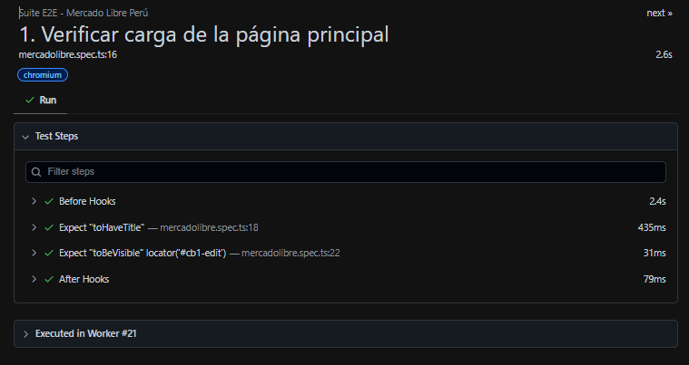
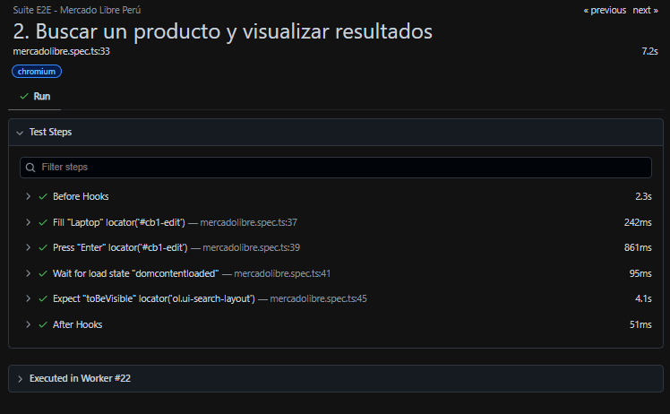
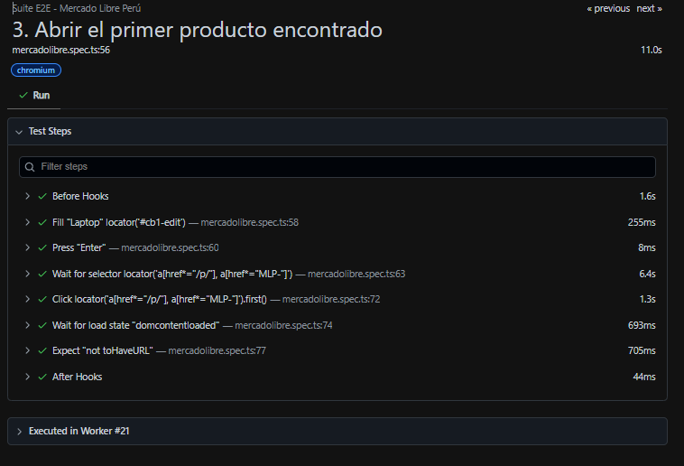
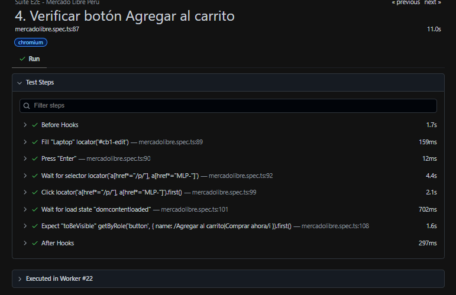
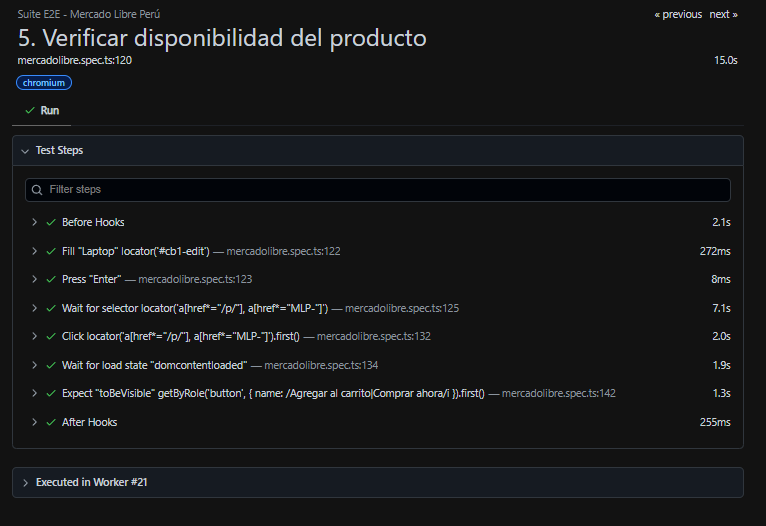
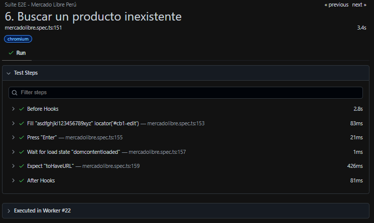
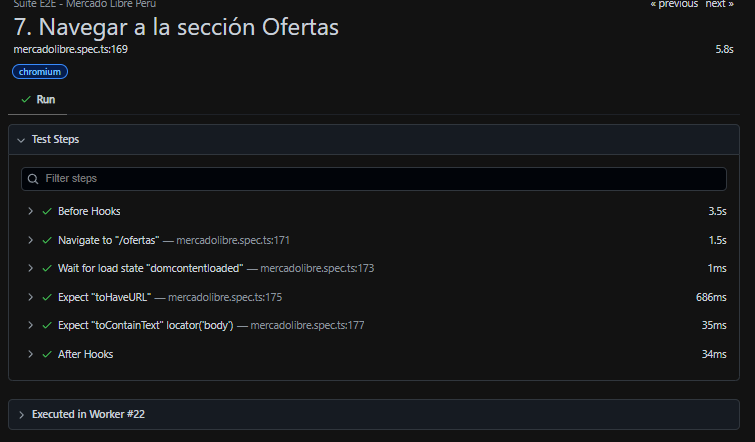
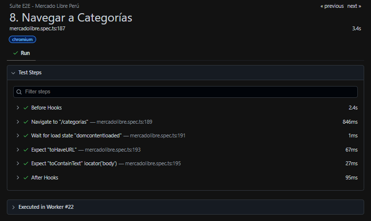
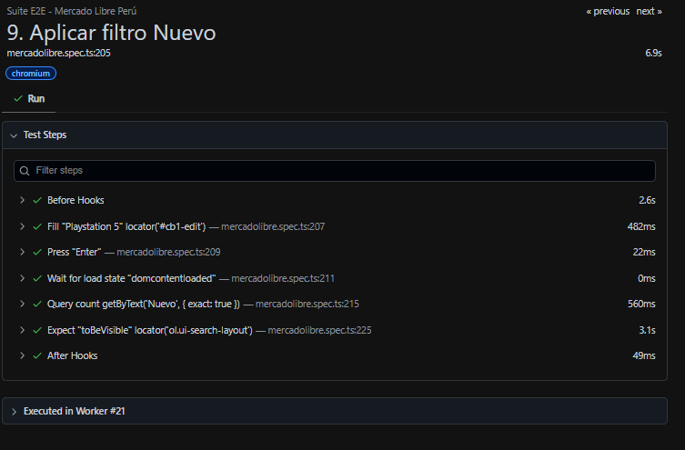
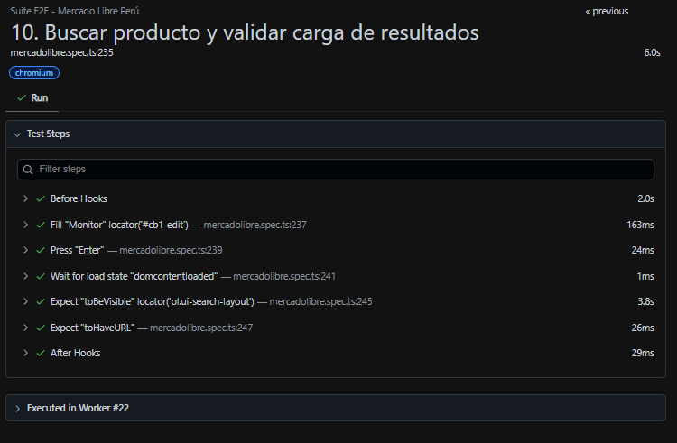

# UNIVERSIDAD NACIONAL SAN CRISTÓBAL DE HUAMANGA

## Facultad de Ingeniería de Minas, Geología y Civil

### Escuela Profesional de Ingeniería de Sistemas

 

  

---

# LABORATORIO N.° 07

## Automatización de Pruebas E2E con Playwright utilizando TypeScript sobre Mercado Libre Perú

---

## Datos Generales

| Dato | Información |
|------|-------------|
| **Asignatura** | IS-489 Pruebas y Aseguramiento de Calidad de Software |
| **Docente** | Ing. Lizbeth Jaico Quispe |
| **Estudiante** | Jhon Eymer Velarde Yllisca |
| **Código** | 27222126 |
| **Fecha** | 29 de junio de 2026 |
| **Laboratorio** | Laboratorio 07 |

---

# Introducción

El aseguramiento de la calidad del software constituye una actividad esencial durante el ciclo de vida del desarrollo, ya que permite garantizar que una aplicación funcione correctamente antes de ser utilizada por los usuarios finales. Una de las técnicas más empleadas actualmente consiste en la automatización de pruebas End-to-End (E2E), las cuales simulan el comportamiento de un usuario real interactuando con el sistema.

En este laboratorio se empleó **Playwright** junto con **TypeScript** para automatizar diferentes flujos funcionales del sitio web **Mercado Libre Perú**, permitiendo verificar el correcto funcionamiento de procesos relacionados con navegación, búsqueda de productos, visualización de resultados y aplicación de filtros.

---

# Objetivos

## Objetivo General

Automatizar pruebas funcionales End-to-End utilizando Playwright con TypeScript sobre el sitio web Mercado Libre Perú.

## Objetivos Específicos

- Comprender el funcionamiento de Playwright.
- Automatizar procesos de navegación.
- Automatizar búsquedas de productos.
- Validar resultados mediante assertions con `expect()`.
- Automatizar filtros y navegación entre distintas secciones del sitio.

---

# Fundamentación Teórica

## ¿Qué es Playwright?

Playwright es un framework de automatización desarrollado por Microsoft que permite controlar navegadores modernos como Chromium, Firefox y WebKit. Su principal finalidad consiste en automatizar pruebas funcionales, pruebas End-to-End (E2E) y validaciones sobre aplicaciones web.

Entre sus principales características destacan:

- Automatización multiplataforma.
- Soporte para múltiples navegadores.
- Esperas automáticas.
- Capturas de pantalla.
- Grabación de video.
- Generación de reportes.
- Integración con TypeScript y JavaScript.

---

## ¿Qué son las pruebas End-to-End (E2E)?

Las pruebas End-to-End verifican el funcionamiento completo de un sistema simulando las acciones que realiza un usuario real, desde el ingreso al sitio web hasta la validación del resultado esperado.

Estas pruebas permiten detectar errores relacionados con:

- Navegación.
- Formularios.
- Búsquedas.
- Carrito de compras.
- Filtros.
- Flujo completo del sistema.

---

# Desarrollo del Laboratorio

Durante el laboratorio se implementaron diez casos de prueba automatizados sobre Mercado Libre Perú.

---

# Caso de Prueba 1

## Verificar carga de la página principal

**Objetivo:** Comprobar que Mercado Libre cargue correctamente.

**Resultado esperado:** La página debe mostrar el buscador principal y el título correspondiente.

### Evidencia

---

# Caso de Prueba 2

## Buscar un producto y visualizar resultados

**Objetivo:** Realizar una búsqueda de un producto existente.

**Resultado esperado:** Debe mostrarse el listado de resultados.

### Evidencia

---

# Caso de Prueba 3

## Abrir el primer producto encontrado

**Objetivo:** Verificar que sea posible ingresar al detalle de un producto desde los resultados.

**Resultado esperado:** Debe abrirse la página del producto seleccionado.

### Evidencia

---

# Caso de Prueba 4

## Verificar botón "Agregar al carrito"

**Objetivo:** Comprobar que un producto disponible presente la opción de agregarse al carrito.

**Resultado esperado:** Debe visualizarse el botón **Agregar al carrito** o **Comprar ahora**.

### Evidencia

---

# Caso de Prueba 5

## Verificar disponibilidad del producto

**Objetivo:** Comprobar que el producto permita confirmar disponibilidad mediante controles de compra.

**Resultado esperado:** Debe mostrarse el selector o el botón de compra respectivo.

### Evidencia

---

# Caso de Prueba 6

## Buscar un producto inexistente

**Objetivo:** Verificar el comportamiento del buscador ante una consulta inexistente.

**Resultado esperado:** La búsqueda debe completarse sin errores y mostrar la URL del intento de búsqueda.

### Evidencia

---

# Caso de Prueba 7

## Navegar a la sección Ofertas

**Objetivo:** Comprobar la navegación hacia la página de ofertas.

**Resultado esperado:** Debe cargarse correctamente la sección de ofertas y la URL correspondiente.

### Evidencia

---

# Caso de Prueba 8

## Navegar a Categorías

**Objetivo:** Verificar el acceso a la sección de categorías.

**Resultado esperado:** Debe abrirse correctamente la página de categorías.

### Evidencia

---

# Caso de Prueba 9

## Aplicar filtro "Nuevo"

**Objetivo:** Comprobar la aplicación del filtro de condición "Nuevo".

**Resultado esperado:** La búsqueda debe continuar mostrando la grilla de productos con el filtro aplicado.

### Evidencia

---

# Caso de Prueba 10

## Buscar producto y validar carga de resultados

**Objetivo:** Verificar nuevamente el funcionamiento del buscador utilizando otro producto (Monitor).

**Resultado esperado:** Debe mostrarse el listado de productos relacionados y reflejarse en la URL.

### Evidencia

---

# Resumen General de Ejecución de Pruebas

A continuación se presenta el reporte final de la terminal de VS Code y el HTML Reporter demostrando la ejecución exitosa de toda la suite de pruebas E2E.

### Evidencia General

---