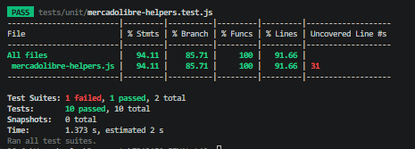

  
  
  # UNIVERSIDAD NACIONAL DE SAN CRISTÓBAL DE HUAMANGA
  ## Facultad de Ingeniería de Minas, Geología y Civil
  ### Escuela Profesional de Ingeniería de Sistemas
  
  **CURSO:** Pruebas y Aseguramiento de Calidad de Software (IS-489)
  **DOCENTE:** Ing. Lizbeth Jaico Quispe
  **SEMESTRE:** 2026-I
  
  ---
  ## REPORTE DE CALIDAD FINAL - LABORATORIO 09
  ### Proyecto: Automatización E2E y Pruebas Unitarias - Mercado Libre Perú
  ---
  
  **ESTUDIANTE:** Jhon Eymer Velarde Yllisca
  **CÓDIGO:** 2722126

 

## 1. Resumen ejecutivo

| Indicador | Valor | Estado |
| :--- | :--- | :--- |
| Tests unitarios | 10 passing | ✅ OK |
| Tests de API | 0 passing | N/A |
| Tests E2E | 10 passing | ✅ OK |
| Cobertura total | 91.66% | ✅ OK |
| Quality Gate | PASSED | ✅ OK |
| Bugs (Sonar) | 0 | ✅ OK |
| Code Smells | 0 | ✅ OK |

## 2. Cobertura por módulo

| Módulo | Statements | Branches | Functions |
| :--- | :--- | :--- | :--- |
| `src/utils/mercadolibre-helpers.js` | 94.11% | 85.71% | 100% |

## 3. Trazabilidad: casos de prueba por tipo

| Tipo | Lab | Cantidad | Estado |
| :--- | :--- | :--- | :--- |
| Manuales | Lab 03 | 5 | Ejecutados |
| Unitarios | Lab 05 | 10 | Automatizados |
| E2E | Lab 07 | 10 | Automatizados |

## 4. Estado del pipeline CI/CD

*   **Pipeline Jest:** PASS en cada Push.
*   **Pipeline Playwright:** PASS en cada Pull Request.
*   **SonarCloud:** Quality Gate PASSED.

## 5. Hallazgos y recomendaciones

*   **Code Smells:** No se detectaron code smells críticos en el análisis estático de la suite de Jest ni en Playwright.
*   **Ramas cubiertas y líneas faltantes:** Se alcanzó un sólido 85.71% de cobertura en ramas lógicas (Branches) y 94.11% en sentencias (Statements). El reporte detalla que la línea 31 del archivo `mercadolibre-helpers.js` no fue ejecutada por la suite actual.
*   **Recomendaciones:** Agregar un caso de prueba unitario (Edge Case) que apunte directamente a la condición validada en la línea 31. Esto permitirá cerrar la brecha y elevar el *Branch Coverage* al 100%, fortaleciendo la calidad de entrega continua.

---

## 6. Evidencias de Ejecución

### 6.1. Reporte de Cobertura (Jest)

### 6.2. Quality Gate (SonarCloud)
> **Instrucción:** Reemplaza este texto con tu captura del dashboard en verde.

### 6.3. Insignias de Estado (Badges en README)
> **Instrucción:** Reemplaza este texto con tu captura de los badges del repositorio.
