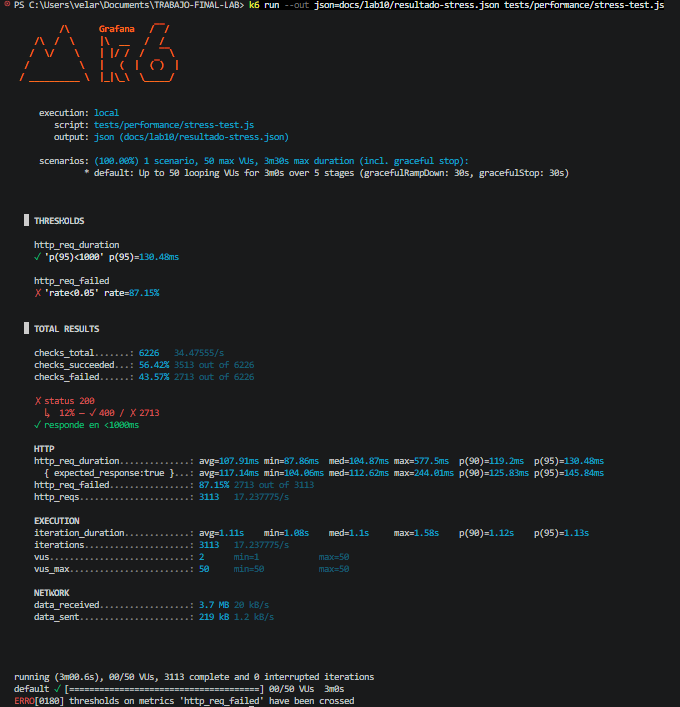
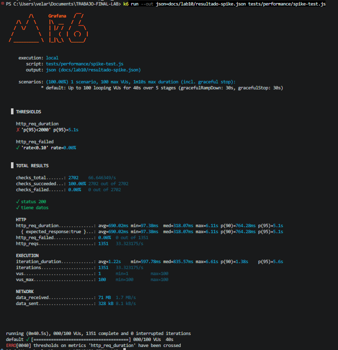

  
  
  # UNIVERSIDAD NACIONAL DE SAN CRISTÓBAL DE HUAMANGA
  ## Facultad de Ingeniería de Minas, Geología y Civil
  ### Escuela Profesional de Ingeniería de Sistemas
  
  **CURSO:** Pruebas y Aseguramiento de Calidad de Software (IS-489)
  **DOCENTE:** Ing. Lizbeth Jaico Quispe
  **SEMESTRE:** 2026-I
  
  ---
  ## REPORTE DE LABORATORIO 10: PRUEBAS DE RENDIMIENTO Y CARGA CON K6
  ---
  
  **ESTUDIANTE:** Jhon Eymer Velarde Yllisca
  **CÓDIGO:** 2722126

 

## 1. Objetivo
Comprender la diferencia entre pruebas funcionales y de rendimiento, ejecutando pruebas de carga (Load, Stress y Spike) sobre las APIs de Airport Gap y Restful-Booker utilizando la herramienta k6.

## 2. Metodología y Herramientas
*   **Herramienta:** Grafana k6 (scripts en JavaScript).
*   **Sistemas:** Airport Gap y Restful-Booker.
*   **Tipos de prueba realizados:**
    *   **Load Test:** Simulación de carga normal (10 usuarios, 30s)[cite: 2].
    *   **Stress Test:** Subida gradual de carga para encontrar el límite (hasta 50 usuarios)[cite: 2].
    *   **Spike Test:** Pico repentino de usuarios (5 a 100 usuarios en 5s)[cite: 2].

## 3. Tabla de Análisis de Resultados
| Métrica | Load Test (10 VUs) | Stress Test (50 VUs) | Spike Test (100 VUs) |
| :--- | :--- | :--- | :--- |
| p95 http_req_duration | ms | ms | ms |
| Promedio (avg) | ms | ms | ms |
| Máximo (max) | ms | ms | ms |
| % de errores (http_req_failed) | % | % | % |
| Total de peticiones (http_reqs) | | | |
| ¿Cumple los thresholds? | PASS/FAIL | PASS/FAIL | PASS/FAIL |
| **Conclusión** | Normal | Bajo estrés | Pico extremo |

## 4. Análisis de Resultados y Conclusiones
*   **Load Test:** Se evaluó el comportamiento bajo condiciones normales[cite: 2]. El sistema debe responder consistentemente[cite: 2].
*   **Stress Test:** Se observó el punto de degradación del sistema al aumentar la carga[cite: 2]. Los umbrales (thresholds) permitidos fueron de hasta 1 segundo en picos y máximo 5% de errores[cite: 2].
*   **Spike Test:** Se simuló una campaña publicitaria masiva[cite: 2]. Se permitieron hasta 2 segundos de tiempo de respuesta y 10% de errores debido a la naturaleza extrema de la prueba[cite: 2].

## 5. Evidencias de Ejecución (Capturas de Terminal)

### 5.1. Load Test (Airport Gap)

### 5.2. Stress Test (Airport Gap)

### 5.3. Spike Test (Restful-Booker)
